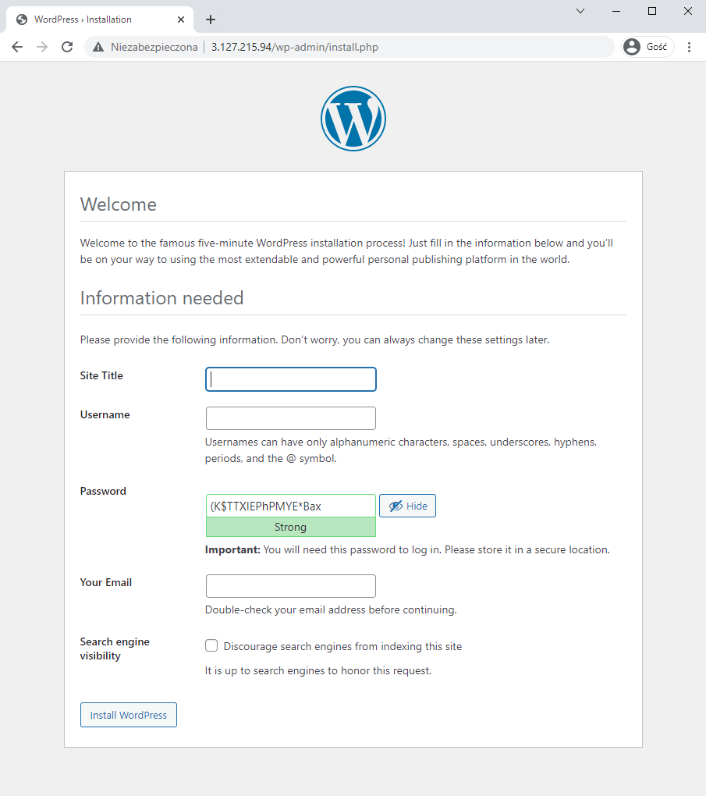

# Automate WordPress install

## Setup nodes to install WordPress on

Template is:
```ini
[<group_name>]
<ip_address> <attr>=<value>
```

In this case:
```ini
[blog_nodes]
1.2.3.4 ansible_user=ec2-user
```


## Setup ssh keys

Use _ssh-agent_ to manage your ssh keys

1. Start _ssh-agent_ service
    ```sh
    eval 'ssh-agent'
    ```
1. Add your key
    ```sh
    ssh-add /path/to/your/key
    ```


## Test connection to given nodes

> __Important:__ Requires available ssh keys. 

```bash
ansible -m ping -i hosts.ini blog_nodes
```


## Create services configuration files

Required config files:
1. MariaDB `.repo`
1. Apache `.conf`
1. WordPress `.php`

## Create ansible configuration .yaml file

Ansible responsibilities:
1. Apache server installation and configuration
1. Download and extract WordPress files
1. EPEL package installation
1. PHP repo and packages installation
1. MariaDB installation and configuration
1. Database creation and configuration
1. Restart apache server


# Usage

To apply provided configuration

1. Create virtual machine (or just prepare its public IP)
1. Adjust `hosts.ini` to match your machines addresses
1. Adjust `vars` in `setup.yaml` to match your needs (especially credentials :wink: )
1. Let ansible to the rest
    ```sh
    ansible-playbook -i hosts.ini setup.yaml
    ```


# Proof

